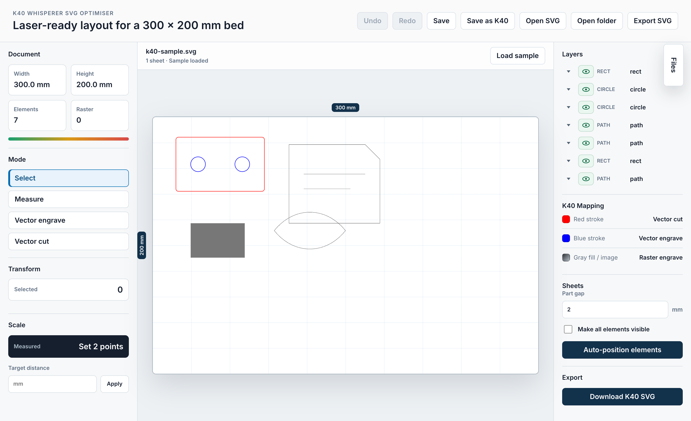

# K40 SVG Optimiser



K40 SVG Optimiser is a browser-based helper for preparing SVG files for a popular K40 CO2 laser cutter running the open source K40 Whisperer software.

Many SVG files found online are designed for a specific material thickness, a different page size, or a different laser workflow. Making them usable on a K40 can mean opening a vector editor, measuring by hand, resizing everything, moving pieces around, fixing layer visibility, and changing line colours one outline at a time. This app brings those common preparation tasks into one focused workspace.

The goal is simple: open an SVG, make it fit the 300 mm x 200 mm K40 bed, mark outlines for cutting or engraving, arrange parts efficiently, and export a K40-ready SVG.

## What Problem It Solves

K40 Whisperer recognises laser operations from SVG colours and raster content:

- Red outlines are used for vector cutting.
- Blue outlines are used for vector engraving.
- Grayscale artwork and raster images are used for raster engraving.

That colour-based workflow is powerful, but it also means a downloaded SVG often needs careful cleanup before it is ready to send to the laser. K40 SVG Optimiser helps with the fiddly preparation work so makers can spend less time wrestling with files and more time making parts.

## Features

- Open and preview SVG documents directly in the browser.
- Work against the K40 bed size of 300 mm x 200 mm.
- Measure the distance between two points in millimetres.
- Resize a whole SVG by choosing two points and entering the desired real-world distance.
- Show target markers for selected measurement points.
- Select single or multiple SVG elements on the canvas.
- Move selected items by dragging.
- Resize selected items with bounding-box corner handles.
- Rotate selected items with a dedicated rotate handle.
- Keep the live selection bounding box aligned with moved, resized, and rotated artwork.
- Recolour outlines for K40 Whisperer with one click:
  - Vector cut: full red stroke, `rgb(255, 0, 0)`.
  - Vector engrave: full blue stroke, `rgb(0, 0, 255)`.
- Keep K40 cut and engrave outlines at a consistent 1 px stroke width.
- Make outlines easier to select with fuzzy hit detection.
- Show elements and groups in a layer-style tree.
- Toggle visibility for individual elements and groups.
- Rename elements and groups from the tree.
- Collapse and expand tree items.
- Use undo and redo for editing operations.
- Open a folder recursively and browse SVG files from a fixed file drawer.
- Detect unsaved changes before switching documents.
- Save back to disk where the browser supports the File System Access API.
- Save a K40 copy using the original filename plus `k40`.
- Export/download the final K40-ready SVG.
- Keyboard shortcuts:
  - `Cmd/Ctrl + S`: save.
  - `Cmd/Ctrl + Shift + S`: save a K40 copy.
  - `Cmd/Ctrl + Z`: undo.
  - `Cmd/Ctrl + Shift + Z`: redo.
- Auto-position parts across one or more overlapping sheet groups.
- Keep sheet groups aligned on the same 300 mm x 200 mm bed so the user can toggle sheet visibility for production.
- Optionally make all elements visible before nesting.
- Use SVG nesting to rotate and arrange parts more efficiently.

## SVGnest

The auto-positioning workflow uses code adapted from [SVGnest](https://github.com/Jack000/SVGnest), an open source SVG nesting tool. SVGnest provides the established nesting approach used to search for better arrangements of vector parts, including rotation and space-saving placement.

The required SVGnest runtime files are copied into this application under `public/svgnest` so the app can run without depending on the reference project checkout.

## Getting Started

Install dependencies:

```bash
npm install
```

Start the local development server:

```bash
npm run dev
```

Create a production build:

```bash
npm run build
```

Preview the production build:

```bash
npm run preview
```

## Notes

- The application runs in the browser and keeps edits in memory until they are saved or exported.
- Folder opening and direct saving work best in browsers that support the File System Access API, such as Chromium-based browsers.
- Always check the exported SVG in your normal laser workflow before cutting valuable material.

## Contact

Roland Treiber  
[thecaringdeveloper.com](https://thecaringdeveloper.com)
